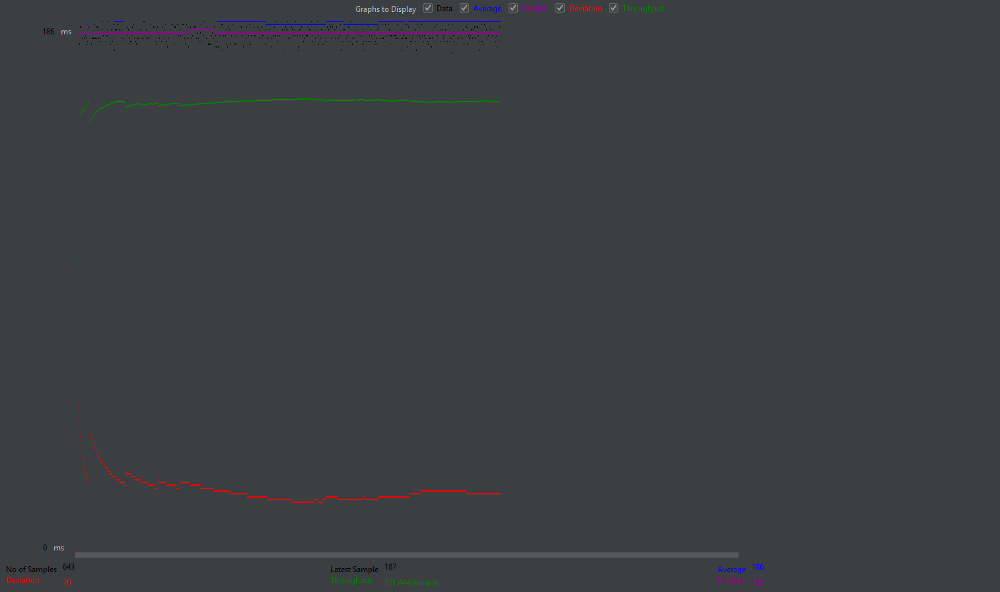
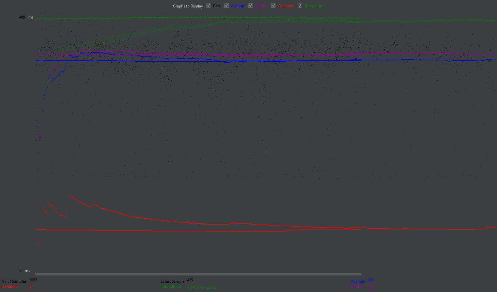
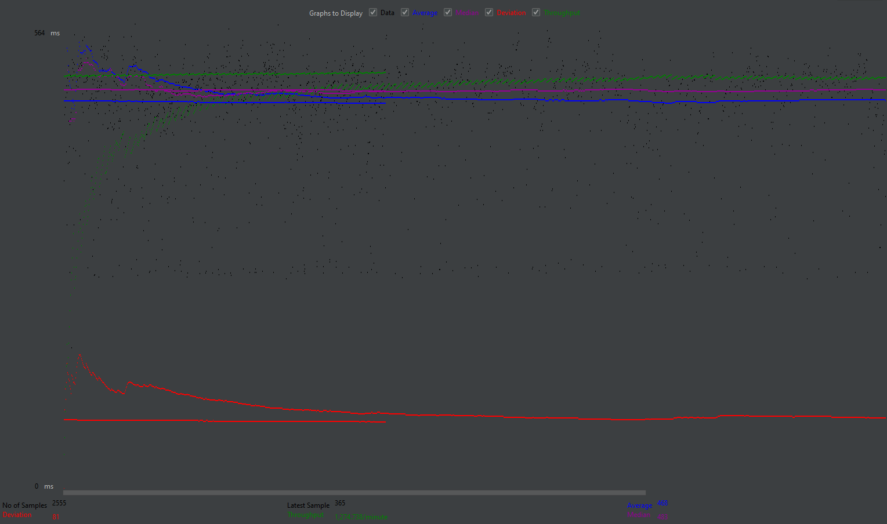
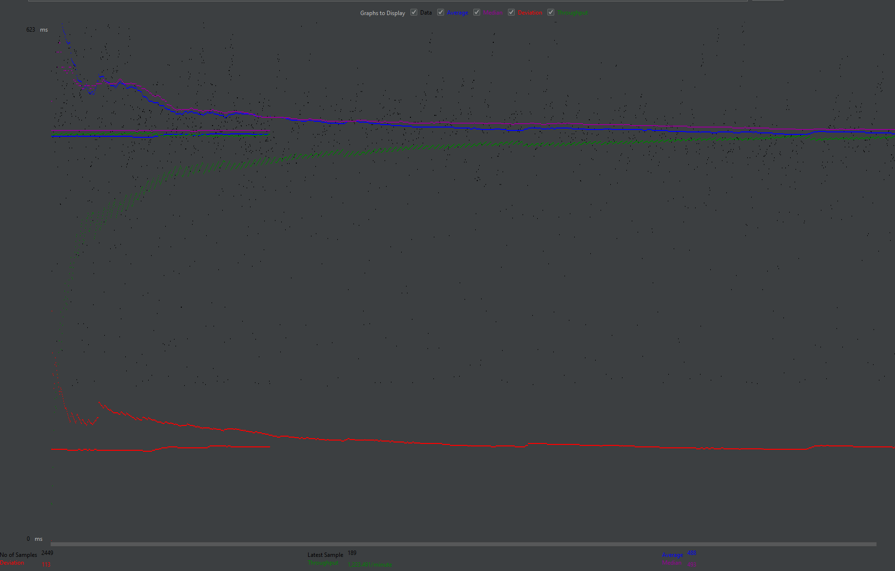

## CS 122B Project 

Yes the base of this is just the API example

---------
Project 1:
---------
Demo video URL: https://youtu.be/hW1ehcmigZw

  Jason Tran's work:
  * Created and completed movie-twenty-list html, javascript, and java servlet
  * Edited single-star html, javascript, and java servlet from api-example to meet project requirements
  * Added base CSS files and did CSS files specific to movie-twenty-list and single-star, such as color theming and shadows
  
  Eric Chang's work:
  * Created and completed single-movie html, javascript, and java servlet
  * Beautifed webpages by editing all CSS files and accounting for various punctuation cases
  * debugged problematic lines of code from movie-twenty-list and single-star html/js files 

---------
Project 2:
---------
Demo video URL: https://youtu.be/QAH5yKksrwk

Jason Tran's work:
* Implemented Browsing/Searching (Task 2)
* Extended Project1 functionality (Task 3)

Eric Chang's work:
* Implemented Login and Sessions(Task 1)
* Added Shopping Cart page and functionality (Task 4)

How the LIKE operator was used in searching:
* Used substring matching for EACH word in a parameter. Capitalization does not matter
* Example, if the parameter for title was "The terminal", the Like clause was (title LIKE %the% OR title LIKE %terminal%). 
* So any movies whose title had substring the or terminal would be included.
* AND is still used between different parameters, such as title and director.
* If title was "The terminal" and stars was "Tom Hanks", part of the WHERE clause would be (title LIKE "%the%" OR title LIKE %terminal%) 
 AND (starName LIKE "%tom%" OR starName LIKE "%hanks%")
* Went with this implementation as it yields the most amount of results while still being considered "relevant" (I mean the substring is in there)
* A person who wants to search movies (compared to say medical documents or court cases) probably won't be the most careful/precise when typing in their search query

---------
Project 3:
---------
Demo video URL: https://youtu.be/NlFyaPVZE-w

Jason Tran's work:
* Added HTTPS (Task 2)
* Encrypt passwords on AWS (Task 4)
* Did XML parsing and insertion (Task 6)

Eric Chang's work:
* Added reCAPTCHA (Task 1)
* Ensured consistent usage of PreparedStatements (Task 3)
* Implemented employee dashboard using stored procedures (Task 5)
* Encrypted the employee password (Task 4/5)

Files with PreparedStatements:

* EmployeeAddMovieServlet (Also uses CallableStatement)
* EmployeeAddStarServlet
* EmployeeLoginServlet
* EmployeeMetadataServlet
* LoginServlet
* datainserters.MovieInserter
* datainserters.StarInserter
* datainserters.StarInMovieInserter
* MovieListServlet
* MovieSearchServlet
* PurchaseServlet
* ShoppingCartServlet
* SingleMovieServlet
* SingleStarServlet

Inconsistency report when running locally
* Duplicate movies: 29
* No movie name: 7
* No movie year: 18
* No movie director name: 7
* No xml FID: 16
* Duplicate actors: 3
*  No actor name: 0
* No actor DOB: 2521
* Actors in cast but not actors file: 14808
* Duplicate cast: 1267
* Movie FIDs that could not be mapped: 948
* No movie FID for cast: 0
* No actor name for cast: 3

XML Parsing Optimizations (local testing time on Jason's PC, no auto-commit)  
Prior to any optimization, it took about 47,000 to 49,000 ms 
 <b>Multi-threading</b>
* Parsing of movies and actors takes place on separate threads (Parsing of casts waits for both of those to finish). 
* Reduced the time to around 41,000 to 43,000 ms 

<b>Batch updates</b>
* Added prepared statement in batches of size 100, then executed the batch update, and repeat until there was no more data
* Reduced time to around 44,000 ms to 45,000 ms 

<b>Both combined</b>
* Reduced time to around 39,000 ms to 40,000 ms  
* When auto-commit is on (I know it doesn't count as an optimization requirement), without the 2 optimizations it was about 7500ms, and with the 2 optimizations it was about 5100ms

---------
Project 4:
---------
Demo video URL: https://youtu.be/s-ihN6WePvM

Jason Tran's work:
* Did fulltext and autocomplete on web (Task 1)

Eric Chang's work:
* Did all of the Android App (Task 2)

---------
Project 5:
---------
- # Connection Pooling
 - #### Include the filename/path of all code/configuration files in GitHub of using JDBC Connection Pooling.
    - WebContent/META-INF/context.xml (File that specifies that we are using pooling and specific settings for pooling)
    - src/MovieSearchServlet (technically any servlet that connects to MySql now uses pooling due to the above files settings, but this is just a particular example)

 - #### Explain how Connection Pooling is utilized in the Fabflix code.
     - Anytime a servlet asks to open a connection to the MySql database, it gets a connection that might have been opened long before. 
     - With connection pooling, code maintains a number of already opened connections, and hands them out to servlets when the request one rather than opening a new one on the spot, which saves time for client who is communicating with the servlet
     - Even when the servlet calls .close() on the connection, the code might not actually close the connection, and instead save the connection as an availible connection in the pool to be handed out again later on
 - #### Explain how Connection Pooling works with two backend SQL.

- # Master/Slave
 - #### Include the filename/path of all code/configuration files in GitHub of routing queries to Master/Slave SQL.

 - #### How read/write requests were routed to Master/Slave SQL?

- # JMeter TS/TJ Time Logs
 - #### Instructions of how to use the `log_processing.py` script to process the JMeter logs.
 - Run the log_processing.py file with a Python 3 interpreter. Any version should be fine but I used Python 3.11
 - It will then ask for a filepath to the log file created by the servlets. Enter in the path (no double quotes)
 - The statistics will be printed our based on that file's contents
 - It will ask prompt you to either enter another filepath if you want to process another file AND combine its statistics with any previous files that have been processed
 - Type "y" and it will request for the path like before, or type "n" to terminate the process

- # JMeter TS/TJ Time Measurement Report
* Analysis descriptions are written relative to Single-Instance or Scaled test plan cases. i.e., saying shortest
* Test runs were all ran for 2 minutes each, reusing the query file if they finished the file befor 2 minutes were done
* Log files and jtl files can be found in the jmeter-results directory

| **Single-instance Version Test Plan**          | **Graph Results Screenshot**       | **Average Query Time(ms)** | **Average Search Servlet Time(ms)** | **Average JDBC Time(ms)** | **Analysis**                                                                                                                                                                                                                                                                                                                                                                                                                                                                       |
|------------------------------------------------|------------------------------------|----------------------------|-------------------------------------|---------------------------|------------------------------------------------------------------------------------------------------------------------------------------------------------------------------------------------------------------------------------------------------------------------------------------------------------------------------------------------------------------------------------------------------------------------------------------------------------------------------------|
| Case 1: HTTP/1 thread                          |      | 186                        | 32                                  | 18                        | 642 req. Has the shortest time in all regards, which makes sense as this test case puts the lightest load on the server with only a single thread.                                                                                                                                                                                                                                                                                                                                 |
| Case 2: HTTP/10 threads                        |     | 398                        | 244                                 | 146                       | 2992 req. Faster than 10 HTTP with no pooling as we aren't spending as much time making connections to the database thanks to pooling. Gets more requests completed than single http, but each requests takes longer, since the servlet is dealing with multiple requests in parallel rather sequentially like in single http                                                                                                                                                      |
| Case 3: HTTPS/10 threads                       |    | 468                        | 234                                 | 140                       | 2545 req. Has nearly the same average servlet time and JDBC time as 10 http no pool, but has a higher Average Query Time. This is due to the Secure part of HTTPS requiring computation and therefore more time, which doesn't involve our servlet, hence those averages are similar to HTTP 10 thread. Also note, if you take the average query time and subtract out the average servlet time for all the test cases, the results are all very similar (~150ms EXCEPT) for HTTPS |
| Case 4: HTTP/10 threads/No connection pooling  |  | 488                        | 330                                 | 211                       | 2439 req. Nearly as slow as HTTPS 10 threads despite no Secure part to take up time, but this is because the servlet is slower due to no connection pooling. You can see it in how the average servlet time and average JDBC are both higher than in HTTPS 10 threads.                                                                                                                                                                                                             |

| **Scaled Version Test Plan**                   | **Graph Results Screenshot** | **Average Query Time(ms)** | **Average Search Servlet Time(ms)** | **Average JDBC Time(ms)** | **Analysis** |
|------------------------------------------------|------------------------------|----------------------------|-------------------------------------|---------------------------|--------------|
| Case 1: HTTP/1 thread                          |    | ??                         | ??                                  | ??                        | ??           |
| Case 2: HTTP/10 threads                        |    | ??                         | ??                                  | ??                        | ??           |
| Case 3: HTTP/10 threads/No connection pooling  |    | ??                         | ??                                  | ??                        | ??           |
